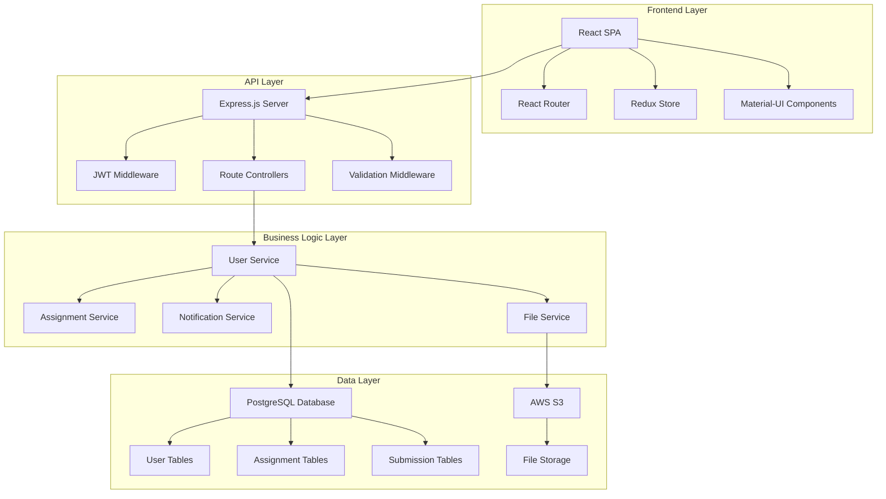
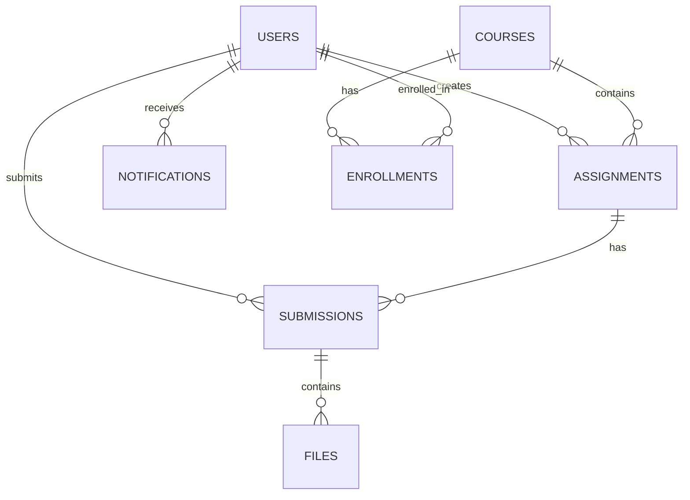

# Design Document

## Overview

The Classroom Assignment Portal is a full-stack web application built with a React frontend and Node.js backend. The system follows a RESTful API architecture with JWT-based authentication, PostgreSQL database, and cloud file storage. The design emphasizes responsive UI, secure data handling, and scalable architecture to support educational institutions of varying sizes.

## Architecture

### System Architecture



### Technology Stack

**Frontend:**
- React 18 with TypeScript for type safety
- Material-UI (MUI) for consistent, accessible components
- Redux Toolkit for state management
- React Query for server state management
- React Hook Form for form handling
- Axios for HTTP requests

**Backend:**
- Node.js with Express.js framework
- TypeScript for type safety
- JWT for authentication
- bcrypt for password hashing
- Multer for file upload handling
- node-cron for scheduled tasks

**Database:**
- PostgreSQL for relational data
- Prisma ORM for database operations
- Redis for session storage and caching

**Infrastructure:**
- AWS S3 for file storage
- AWS CloudFront for CDN
- Docker for containerization
- GitHub Actions for CI/CD

## Components and Interfaces

### Frontend Components

#### Authentication Components
- **LoginForm**: Handles user authentication with email/password
- **SignupForm**: User registration with role selection
- **ProtectedRoute**: Route wrapper for authenticated access
- **RoleGuard**: Component-level role-based access control

#### Dashboard Components
- **StudentDashboard**: Overview of assignments, deadlines, and notifications
- **TeacherDashboard**: Assignment management and student progress overview
- **AdminDashboard**: System statistics and user management

#### Assignment Components
- **AssignmentList**: Paginated list with search and filter capabilities
- **AssignmentCard**: Individual assignment display with actions
- **AssignmentForm**: Create/edit assignment with rich text editor
- **AssignmentDetail**: Full assignment view with submission interface

#### Calendar Components
- **CalendarView**: Monthly calendar with assignment deadlines
- **CalendarEvent**: Individual calendar event component
- **DatePicker**: Date selection for assignment creation

#### Notification Components
- **NotificationCenter**: Dropdown with recent notifications
- **NotificationItem**: Individual notification display
- **NotificationSettings**: User preference configuration

### Backend API Endpoints

#### Authentication Endpoints
```
POST /api/auth/login
POST /api/auth/register
POST /api/auth/logout
POST /api/auth/refresh
GET  /api/auth/profile
```

#### User Management Endpoints
```
GET    /api/users
GET    /api/users/:id
PUT    /api/users/:id
DELETE /api/users/:id
GET    /api/users/:id/assignments
```

#### Assignment Endpoints
```
GET    /api/assignments
POST   /api/assignments
GET    /api/assignments/:id
PUT    /api/assignments/:id
DELETE /api/assignments/:id
GET    /api/assignments/search
```

#### Submission Endpoints
```
GET    /api/submissions
POST   /api/submissions
GET    /api/submissions/:id
PUT    /api/submissions/:id
DELETE /api/submissions/:id
POST   /api/submissions/:id/files
```

#### Notification Endpoints
```
GET    /api/notifications
POST   /api/notifications
PUT    /api/notifications/:id/read
DELETE /api/notifications/:id
GET    /api/notifications/preferences
PUT    /api/notifications/preferences
```

## Data Models

### Database Schema

#### Users Table
```sql
CREATE TABLE users (
    id UUID PRIMARY KEY DEFAULT gen_random_uuid(),
    email VARCHAR(255) UNIQUE NOT NULL,
    password_hash VARCHAR(255) NOT NULL,
    first_name VARCHAR(100) NOT NULL,
    last_name VARCHAR(100) NOT NULL,
    role user_role NOT NULL,
    is_active BOOLEAN DEFAULT true,
    created_at TIMESTAMP DEFAULT CURRENT_TIMESTAMP,
    updated_at TIMESTAMP DEFAULT CURRENT_TIMESTAMP
);

CREATE TYPE user_role AS ENUM ('student', 'teacher', 'administrator');
```

#### Assignments Table
```sql
CREATE TABLE assignments (
    id UUID PRIMARY KEY DEFAULT gen_random_uuid(),
    title VARCHAR(255) NOT NULL,
    description TEXT,
    due_date TIMESTAMP NOT NULL,
    created_by UUID REFERENCES users(id),
    course_id UUID REFERENCES courses(id),
    max_file_size INTEGER DEFAULT 10485760,
    allowed_file_types TEXT[],
    is_active BOOLEAN DEFAULT true,
    created_at TIMESTAMP DEFAULT CURRENT_TIMESTAMP,
    updated_at TIMESTAMP DEFAULT CURRENT_TIMESTAMP
);
```

#### Submissions Table
```sql
CREATE TABLE submissions (
    id UUID PRIMARY KEY DEFAULT gen_random_uuid(),
    assignment_id UUID REFERENCES assignments(id),
    student_id UUID REFERENCES users(id),
    submission_text TEXT,
    grade DECIMAL(5,2),
    feedback TEXT,
    submitted_at TIMESTAMP DEFAULT CURRENT_TIMESTAMP,
    graded_at TIMESTAMP,
    status submission_status DEFAULT 'draft'
);

CREATE TYPE submission_status AS ENUM ('draft', 'submitted', 'graded', 'returned');
```

#### Files Table
```sql
CREATE TABLE files (
    id UUID PRIMARY KEY DEFAULT gen_random_uuid(),
    submission_id UUID REFERENCES submissions(id),
    original_name VARCHAR(255) NOT NULL,
    file_path VARCHAR(500) NOT NULL,
    file_size INTEGER NOT NULL,
    mime_type VARCHAR(100) NOT NULL,
    uploaded_at TIMESTAMP DEFAULT CURRENT_TIMESTAMP
);
```

#### Notifications Table
```sql
CREATE TABLE notifications (
    id UUID PRIMARY KEY DEFAULT gen_random_uuid(),
    user_id UUID REFERENCES users(id),
    title VARCHAR(255) NOT NULL,
    message TEXT NOT NULL,
    type notification_type NOT NULL,
    is_read BOOLEAN DEFAULT false,
    created_at TIMESTAMP DEFAULT CURRENT_TIMESTAMP
);

CREATE TYPE notification_type AS ENUM ('assignment_created', 'deadline_reminder', 'grade_available', 'system_update');
```

### Data Relationships



## Error Handling

### Frontend Error Handling
- **Global Error Boundary**: Catches and displays React component errors
- **API Error Interceptor**: Handles HTTP errors and token refresh
- **Form Validation**: Real-time validation with user-friendly messages
- **Network Error Handling**: Offline detection and retry mechanisms

### Backend Error Handling
- **Global Error Middleware**: Centralized error processing and logging
- **Validation Errors**: Input validation with detailed error messages
- **Database Errors**: Connection handling and transaction rollbacks
- **File Upload Errors**: Size and type validation with clear feedback

### Error Response Format
```json
{
  "success": false,
  "error": {
    "code": "VALIDATION_ERROR",
    "message": "Invalid input data",
    "details": [
      {
        "field": "email",
        "message": "Email format is invalid"
      }
    ]
  },
  "timestamp": "2024-01-15T10:30:00Z"
}
```

## Testing Strategy

### Frontend Testing
- **Unit Tests**: Jest and React Testing Library for component testing
- **Integration Tests**: Testing component interactions and API calls
- **E2E Tests**: Cypress for critical user workflows
- **Accessibility Tests**: axe-core for WCAG compliance
- **Visual Regression Tests**: Chromatic for UI consistency

### Backend Testing
- **Unit Tests**: Jest for service and utility function testing
- **Integration Tests**: Supertest for API endpoint testing
- **Database Tests**: In-memory PostgreSQL for data layer testing
- **Security Tests**: OWASP ZAP for vulnerability scanning
- **Performance Tests**: Artillery for load testing

### Test Coverage Goals
- Unit Tests: 80% code coverage minimum
- Integration Tests: All API endpoints covered
- E2E Tests: Critical user paths covered
- Security Tests: All authentication and authorization flows

### Testing Environment
- **Test Database**: Separate PostgreSQL instance with test data
- **Mock Services**: AWS S3 mocking for file operations
- **CI/CD Integration**: Automated testing on pull requests
- **Test Reporting**: Coverage reports and test result dashboards